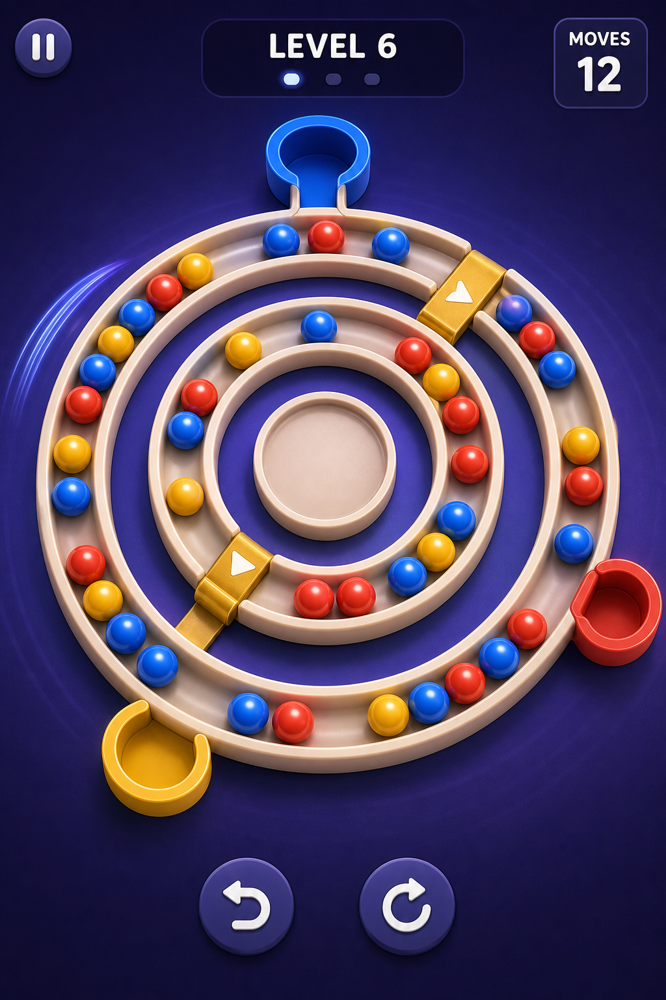

# Orbit Sort

Orbit Sort is a portrait mobile puzzle prototype built around continuous concentric marble tracks. Players rotate rings, transfer marbles outward through one-way gates, and deliver each marble to its matching color exit.

The tracks look continuous and have no visible sockets. Underneath the presentation, the gameplay model uses hidden logical positions so movement, undo, level validation, solvability, and deadlock detection remain deterministic.



## Prototype rules

- No timer.
- No move counter.
- A ring needs at least one marble-sized gap to rotate.
- A completely full ring is jammed.
- Gates transfer one marble outward when the destination has space.
- Matching marbles leave through fixed exits on the outer ring.
- The player wins when every marble is sorted.
- The player loses when marbles remain and no legal rotation, transfer, or exit can make progress.

## Current status

Playable greybox:

- Unity project pinned to `6000.4.0f1`.
- Two JSON-authored prototype levels.
- Continuous concentric tracks with no visible marble sockets.
- Swipe ring rotation and tap-to-transfer gates.
- Automatic matching exits, win state, restart, and undo.
- Search-aware deadlock detection with a visible lose screen.
- Amber last-gap and red full-ring warnings.
- Local, Unity, and continuous-integration validation.

The greybox uses generated geometry and placeholder materials. Art,
animation, audio, haptics, and the remaining three to eight levels follow
after the core loop is approved.

## Requirements

- Unity `6000.4.0f1`
- Python 3.11 or newer for repository validation
- Git

Git LFS is intentionally not enabled yet because it is not installed on every contributor machine. Enable it before committing large source files such as PSD, Blender, FBX, WAV, or video assets.

## Getting started

1. Clone the repository.
2. Open the repository root with Unity Hub using Unity `6000.4.0f1`.
3. Run the repository checks:

   ```bash
   python3 Tools/validate_levels.py
   python3 -m unittest discover -s Tools/tests -v
   ```

4. Create a short-lived branch using an approved prefix.

## Playing the prototype

Open `Assets/OrbitSort/Scenes/Prototype.unity` and press Play.

- Swipe directly around a ring to rotate it.
- Tap a green gate to move an aligned marble outward.
- `Undo` reverses the last completed action.
- `Retry` restores the current level.
- The level arrows switch between the two prototype boards.

For editor keyboard QA, use `U` for undo, `R` for retry, and the left or
right arrow key to change levels.

## Branch workflow

`main` is the only permanent branch. Work is completed through small pull requests from branches using one of these prefixes:

- `feature/`
- `fix/`
- `chore/`
- `docs/`
- `test/`
- `release/`

Branch names must describe the work. Personal names, agent names, and tool names are not valid prefixes.

## Repository layout

```text
Assets/OrbitSort/           Unity-owned game assets and code
ConceptArt/                 Current visual direction
Docs/                       Game rules, architecture, and level format
Packages/                   Unity Package Manager dependencies
ProjectSettings/            Version-controlled Unity settings
Schemas/                    JSON schemas
Tools/                      Repository validation tools
.github/                    Pull requests, issues, and CI
```

## Level data

Prototype levels live in:

```text
Assets/OrbitSort/Resources/Levels/levels.json
```

The format is versioned and documented in [Docs/LevelFormat.md](Docs/LevelFormat.md). Level changes must pass the validator before merge.

## License

No open-source license has been granted. All rights are reserved by the project owner.
