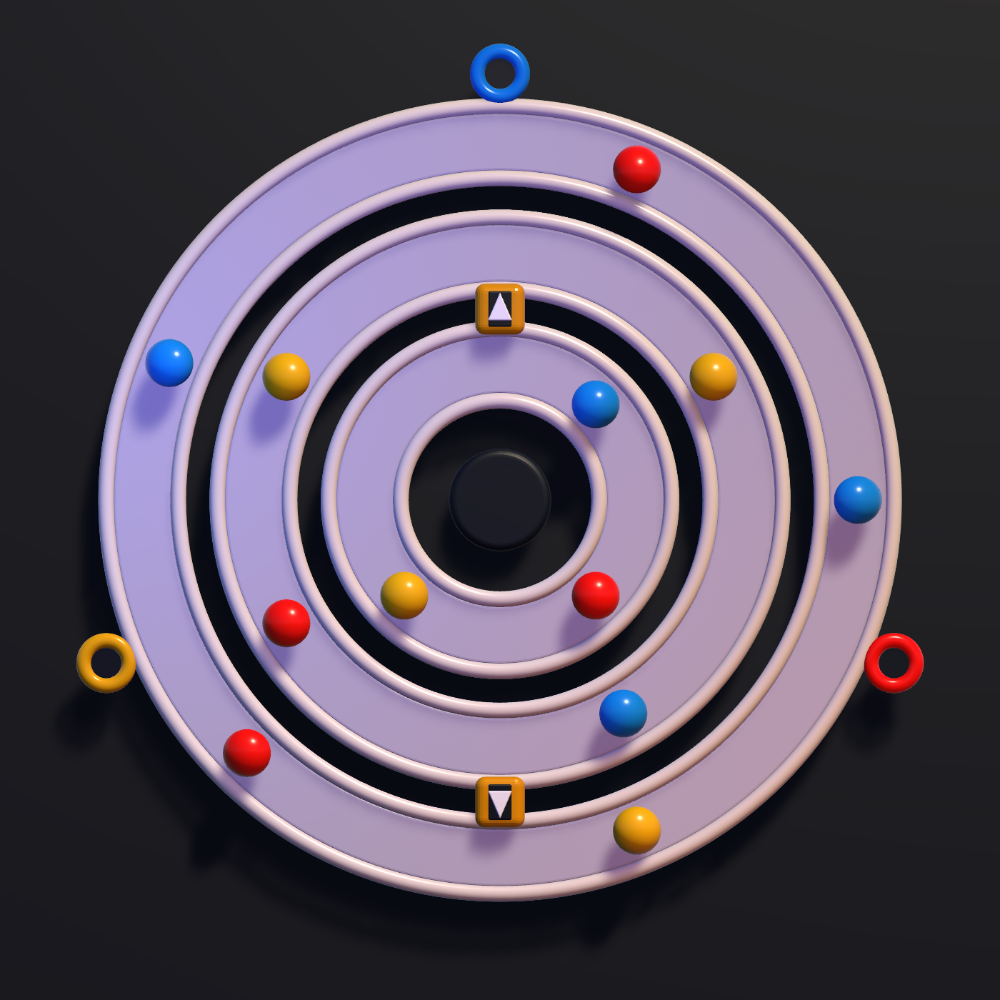

# Orbit Sort

Orbit Sort is a portrait mobile puzzle prototype built around continuous concentric marble tracks. Players rotate rings, transfer marbles outward through one-way gates, and deliver each marble to its matching color exit.

The tracks look continuous and have no visible sockets. Underneath the presentation, the gameplay model uses hidden logical positions so movement, undo, level validation, solvability, and deadlock detection remain deterministic.



## Prototype rules

- No timer.
- No move counter.
- A ring needs at least one marble-sized gap to rotate.
- A completely full ring is jammed.
- Gates transfer one marble outward when the destination has space.
- Matching marbles leave through fixed exits on the outer ring.
- The player wins when every marble is sorted.
- The player loses when marbles remain and no legal rotation, transfer, or exit can make progress.

## Current status

Playable prototype:

- Unity project pinned to `6000.4.0f1`.
- Two JSON-authored prototype levels.
- Three Blender-authored concentric ring assets with visible gaps between them.
- Exactly two rounded, arrow-marked transfer portals.
- Three short color receiver tubes around the outer ring.
- Blender-authored studio backdrop with PBR lighting and soft shadows.
- Perpendicular orthographic top-down gameplay camera.
- Frame-independent ring dragging with persistent FBX instances and 60 FPS
  mobile frame pacing.
- Swipe ring rotation and directional marble-to-portal transfers.
- Gravity-style portal animation with continuous shrink, launch, and regrowth.
- Receiver intake followed by a colored shred-fragment burst for every
  sorted marble.
- Automatic matching exits, win state, restart, and undo.
- Search-aware deadlock detection with a visible lose screen.
- Local, Unity, and continuous-integration validation.

The approved geometry is exported from Blender and imported into Unity;
Unity does not procedurally rebuild it. Additional animation polish,
audio, haptics, and the remaining three to eight levels follow after
this visual milestone is approved.

## Requirements

- Unity `6000.4.0f1`
- Python 3.11 or newer for repository validation
- Blender `5.1.1` for regenerating board model exports
- Git

The prototype's Blender and FBX files are kept below 1 MB each and are
tracked directly. Enable Git LFS before adding materially larger source
art, audio, or video files.

## Getting started

1. Clone the repository.
2. Open the repository root with Unity Hub using Unity `6000.4.0f1`.
3. Run the repository checks:

   ```bash
   python3 Tools/validate_levels.py
   python3 -m unittest discover -s Tools/tests -v
   ```

4. Create a short-lived branch using an approved prefix.

## Playing the prototype

Open `Assets/OrbitSort/Scenes/Prototype.unity` and press Play.

- Swipe directly around a ring to rotate it.
- Press an aligned marble and swipe it toward the arrow-marked gold
  portal to move it outward.
- `Undo` reverses the last completed action.
- `Retry` restores the current level.
- The level arrows switch between the two prototype boards.

For editor keyboard QA, use `U` for undo, `R` for retry, and the left or
right arrow key to change levels.

## Branch workflow

`main` is the only permanent branch. Work is completed through small pull requests from branches using one of these prefixes:

- `feature/`
- `fix/`
- `chore/`
- `docs/`
- `test/`
- `release/`

Branch names must describe the work. Personal names, agent names, and tool names are not valid prefixes.

## Repository layout

```text
Assets/OrbitSort/           Unity-owned game assets and code
ArtSource/                  Authoritative Blender source
ConceptArt/                 Current visual direction
Docs/                       Game rules, architecture, and level format
Packages/                   Unity Package Manager dependencies
ProjectSettings/            Version-controlled Unity settings
Schemas/                    JSON schemas
Tools/                      Repository validation tools
.github/                    Pull requests, issues, and CI
```

## Level data

Prototype levels live in:

```text
Assets/OrbitSort/Resources/Levels/levels.json
```

The format is versioned and documented in [Docs/LevelFormat.md](Docs/LevelFormat.md). Level changes must pass the validator before merge.

## Board art pipeline

`ArtSource/OrbitSortBoardAssets.blend` is the authoritative production
source. Regenerate the Unity FBX models with:

```bash
/Applications/Blender.app/Contents/MacOS/Blender \
  --background \
  --python Docs/Tools/export_board_assets.py
```

The exporter preserves centered ring pivots and reusable portal, receiver,
hub, marble, and shadow-catching backdrop meshes. Imported board models are
validated by the Unity Edit Mode test suite. The
`Orbit Sort/Render Static Board Preview` editor command regenerates the
Unity top-down visual reference without entering Play Mode.

To intentionally rebuild the checked-in Blender source from the scripted
geometry definition, pass Blender's argument separator followed by the
exporter flag:

```bash
/Applications/Blender.app/Contents/MacOS/Blender \
  --background \
  --python Docs/Tools/export_board_assets.py \
  -- --rebuild
```

The matching direct-overhead Blender comparison render is generated with
`Docs/Tools/render_topdown_blender_reference.py`.

## Performance profiling

Use `Orbit Sort/Profile Live Ring Rotation` to run the repeatable Play Mode
rotation benchmark. It compares idle, continuous rotation, and snap
phases, then writes the measurements to `Library/Profiling/`.

The latest before-and-after results are documented in
[Docs/Performance.md](Docs/Performance.md).

## License

No open-source license has been granted. All rights are reserved by the project owner.
